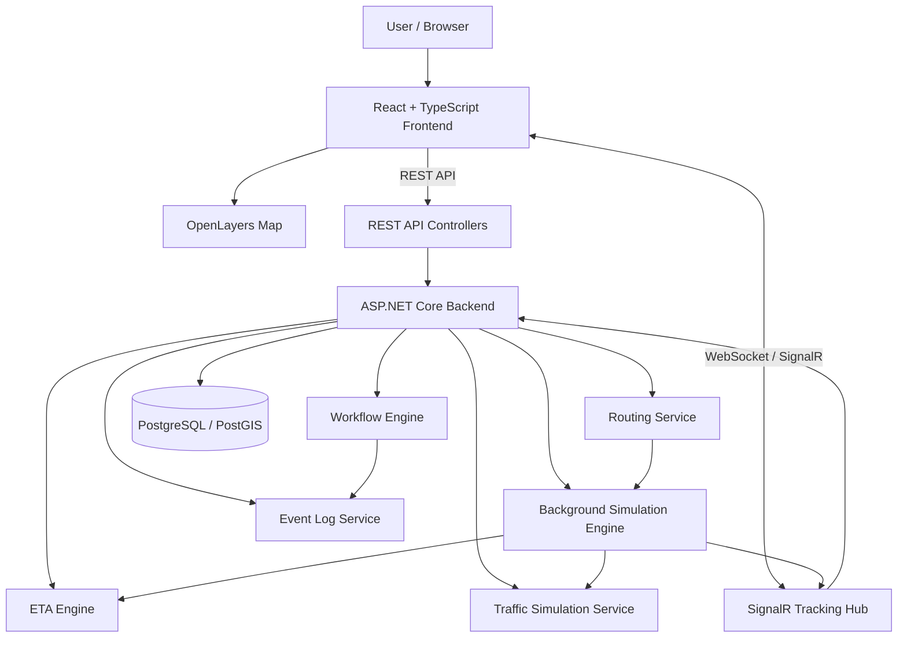
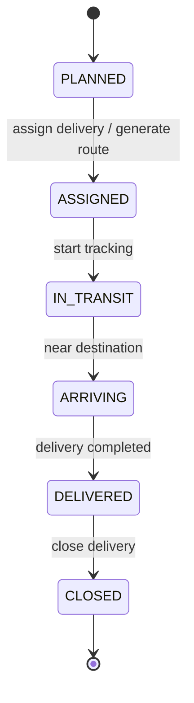
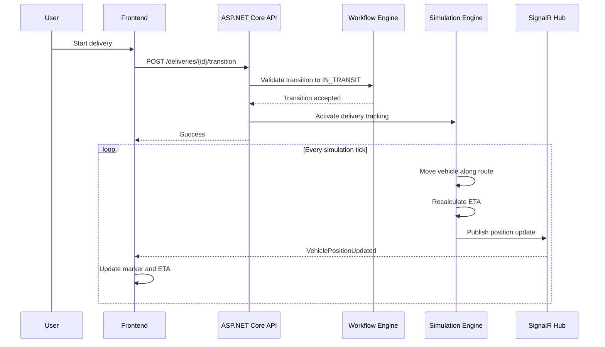

1. High-level architecture diagram

```mermaid
flowchart TD
User[User / Browser]

    Frontend[React + TypeScript Frontend]
    Map[OpenLayers Map]

    Backend[ASP.NET Core Backend]
    RestApi[REST API Controllers]
    SignalR[SignalR Tracking Hub]

    Workflow[Workflow Engine]
    Routing[Routing Service]
    Simulation[Background Simulation Engine]
    ETA[ETA Engine]
    Traffic[Traffic Simulation Service]
    Events[Event Log Service]

    DB[(PostgreSQL / PostGIS)]

    User --> Frontend
    Frontend --> Map

    Frontend -->|REST API| RestApi
    Frontend <-->|WebSocket / SignalR| SignalR

    RestApi --> Backend
    SignalR --> Backend

    Backend --> Workflow
    Backend --> Routing
    Backend --> Simulation
    Backend --> ETA
    Backend --> Traffic
    Backend --> Events

    Workflow --> Events
    Simulation --> ETA
    Simulation --> Traffic
    Simulation --> SignalR
    Routing --> Simulation

    Backend --> DB
```   
2. Delivery workflow state diagram

```mermaid
stateDiagram-v2
    [*] --> PLANNED

    PLANNED --> ASSIGNED: assign delivery / generate route
    ASSIGNED --> IN_TRANSIT: start tracking
    IN_TRANSIT --> ARRIVING: near destination
    ARRIVING --> DELIVERED: delivery completed
    DELIVERED --> CLOSED: close delivery

    CLOSED --> [*]
```
3. Real-time tracking sequence diagram

```mermaid
sequenceDiagram
    participant User
    participant Frontend
    participant API as ASP.NET Core API
    participant Workflow as Workflow Engine
    participant Simulation as Simulation Engine
    participant Hub as SignalR Hub

    User->>Frontend: Start delivery
    Frontend->>API: POST /deliveries/{id}/transition
    API->>Workflow: Validate transition to IN_TRANSIT
    Workflow-->>API: Transition accepted
    API->>Simulation: Activate delivery tracking
    API-->>Frontend: Success

    loop Every simulation tick
        Simulation->>Simulation: Move vehicle along route
        Simulation->>Simulation: Recalculate ETA
        Simulation->>Hub: Publish position update
        Hub-->>Frontend: VehiclePositionUpdated
        Frontend->>Frontend: Update marker and ETA
    end
```